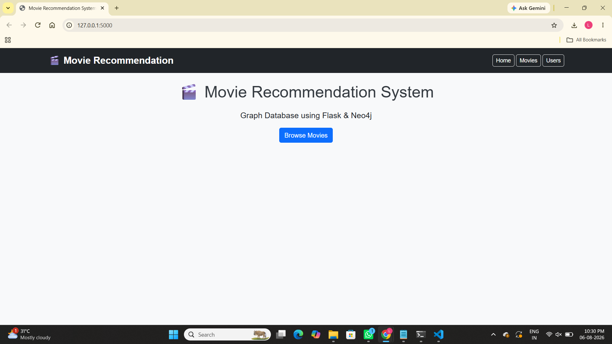
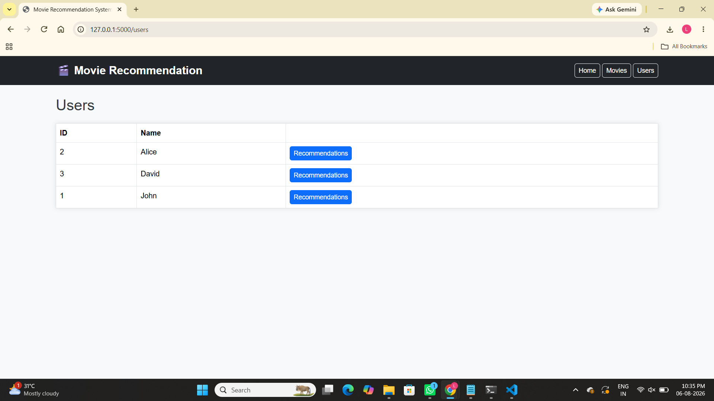
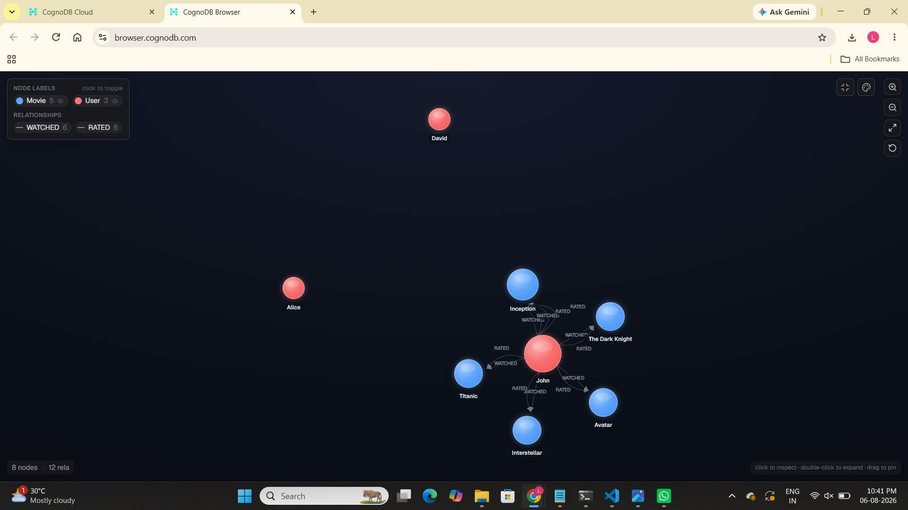
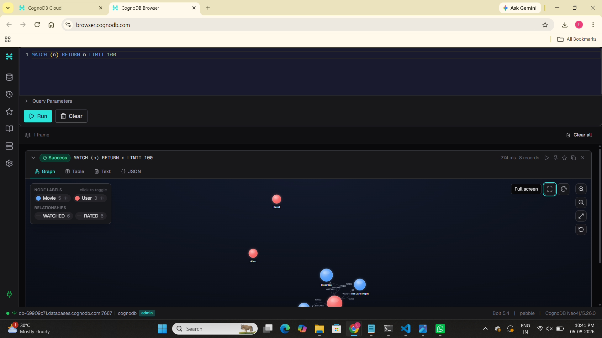

# 🎬 Wexa Movie Recommendation System using CognoDB Graph Database

## 📌 Project Overview

**Wexa Movie Recommendation System** is a full-stack Flask web application designed to provide movie browsing, user profiles, and personalized movie recommendations using a **graph database approach**.

The application uses **CognoDB as the graph database layer** to store and manage relationships between users, movies, and genres. By representing data as connected nodes and relationships, the system can efficiently traverse the graph and generate meaningful movie recommendations.

This project was developed as part of the **WEXA AI Graph Database Application Assignment**.

---

# 🎯 Objectives

The main objectives of this project are:

- Develop a movie recommendation system using a graph database.
- Integrate Flask with CognoDB for graph data management.
- Design a graph model for users, movies, and genres.
- Store and retrieve connected data using Cypher queries.
- Generate recommendations based on graph relationships.
- Understand graph database concepts and relationship traversal.

---

# ✨ Features

## 🎥 Movie Catalog

- Browse available movies.
- View movie details.
- Display movie information dynamically.

## 👤 User Management

- User profile management.
- Store user information.
- Track user-movie interactions.

## 🤖 Personalized Recommendations

- Generate movie recommendations using graph relationships.
- Analyze user preferences.
- Find similar users and related movies.

## 🕸️ Graph Database Integration

- CognoDB graph database connectivity.
- Cypher query execution.
- Relationship-based data retrieval.

## ⚡ Modular Flask Architecture

- Flask Blueprints for route management.
- Service layer for business logic.
- Separate database layer.

---

# 🛠️ Technology Stack

| Technology | Purpose |
|------------|---------|
| Python 3.x | Backend Programming |
| Flask | Web Application Framework |
| CognoDB | Graph Database |
| Neo4j Python Driver | Bolt Protocol Connectivity |
| Cypher | Graph Query Language |
| HTML5 | Frontend Structure |
| CSS3 | Styling |
| JavaScript | Client-side Functionality |
| Jinja2 | Template Rendering |
| Git & GitHub | Version Control |

---

# 🏗️ System Architecture
            User

             ↓

          Browser

             ↓

    Flask Application

             ↓

      Routes Layer

             ↓

     Service Layer

             ↓

    Cypher Queries

             ↓

    CognoDB Database

             ↓

Recommendation Results

             ↓

      HTML Templates
---

# 🕸️ Graph Database Design

The application uses a graph-based data model where entities are represented as nodes and connections are represented as relationships.

## Nodes

### 👤 User Node

Stores user information.

Example:
(User)
{
userId,
name,
email
}

---

### 🎬 Movie Node

Stores movie information.

Example:
(Movie)
{
movieId,
title,
year,
rating
}

---

### 🎭 Genre Node

Stores movie categories.

Example:
(Genre)
{
genreId,
name
}

---

# 🔗 Relationships

The graph structure represents connections between users and movies.
(User)

|
|

WATCHED / RATED

|
|

(Movie)

|
|

BELONGS_TO

|
|

(Genre)


These relationships help the recommendation engine discover similar preferences and suggest relevant movies.

---

# 📂 Project Structure


Wexa-Movie-Recommendation-System

│
├── app.py
│ └── Flask application entry point
│
├── config.py
│ └── Application configuration and environment loading
│
├── test_connection.py
│ └── Database connectivity testing
│
├── database/
│ ├── graph.py
│ ├── models.py
│ └── queries.py
│ └── Graph database operations
│
├── routes/
│ ├── home.py
│ ├── movies.py
│ ├── recommendation.py
│ └── users.py
│ └── Flask route handling
│
├── services/
│ ├── movie_service.py
│ ├── recommendation_service.py
│ └── user_service.py
│ └── Business logic implementation
│
├── seed/
│ └── seed.py
│ └── Initial database data
│
├── templates/
│ └── Jinja2 HTML templates
│
├── static/
│ └── CSS, JavaScript and images
│
└── requirements.txt


---

# 🔌 CognoDB Integration

The application uses **CognoDB as the graph database layer**.

The database connection is handled using the Neo4j-compatible Bolt protocol.

Environment variables required:


SECRET_KEY=your_secret_key

NEO4J_URI=your_cognodb_connection_url

NEO4J_USERNAME=your_username

NEO4J_PASSWORD=your_password


The database layer performs:

- Graph database connection.
- Query execution.
- Node creation.
- Relationship management.
- Data retrieval.

---

# 🔍 Cypher Queries

## Retrieve All Movies

```cypher
MATCH (m:Movie)
RETURN m;
```

---

## Find Movies Watched by User

```cypher
MATCH (u:User)-[:WATCHED]->(m:Movie)

WHERE u.userId=$user_id

RETURN m;
```

---

## Recommendation Query

```cypher
MATCH (u:User)-[:WATCHED]->(m:Movie)

MATCH (m)<-[:WATCHED]-(other:User)

MATCH (other)-[:WATCHED]->(recommended:Movie)

WHERE NOT (u)-[:WATCHED]->(recommended)

RETURN DISTINCT recommended

LIMIT 5;
```

This query recommends movies based on relationships between users and movies.


🚀 Installation and Setup
1. Clone Repository
git clone https://github.com/LakshmiSravaniG/Wexa-Movie-Recommendation-System.git

cd Wexa-Movie-Recommendation-System
2. Create Virtual Environment
Windows
python -m venv venv

venv\Scripts\activate
Linux / Mac
python3 -m venv venv

source venv/bin/activate
3. Install Dependencies
pip install -r requirements.txt
4. Configure Environment Variables

Create a .env file:

SECRET_KEY=your_secret_key

NEO4J_URI=your_cognodb_connection_url

NEO4J_USERNAME=your_username

NEO4J_PASSWORD=your_password
5. Seed Database

Run:

python seed/seed.py
6. Test Database Connection

Run:

python test_connection.py
7. Run Application

Run:

python app.py

Application will be available at:

http://127.0.0.1:5000

📸 Screenshots
Added screenshots of:










⚠️ Challenges Faced
Understanding graph database concepts.
Designing nodes and relationships.
Connecting Flask application with CognoDB.
Writing Cypher queries.
Implementing recommendation logic.
Managing graph traversal operations.

🔮 Future Enhancements
AI-based recommendation algorithms.
TMDB API integration.
Movie posters and trailers.
User ratings and reviews.
Collaborative filtering.
Advanced personalization.
Admin dashboard.

✅ Conclusion

The Wexa Movie Recommendation System demonstrates the practical implementation of a graph database application using Flask and CognoDB.

By representing users, movies, genres, and interactions as connected graph entities, the system efficiently explores relationships and generates personalized recommendations.

This project highlights the advantages of graph databases for relationship-heavy applications such as recommendation systems.

👩‍💻 Author

Lakshmi Sravani Gorantla

Project Repository: https://github.com/LakshmiSravaniG/Wexa-Movie-Recommendation-System

GitHub Profile: https://github.com/LakshmiSravaniG